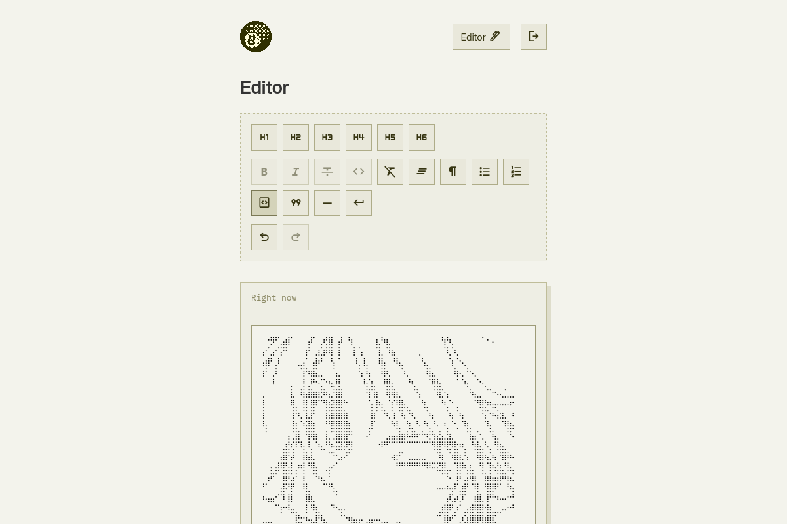

# BlogWay

A serverless, AWS native personal blogging platform. Utilizing AWS SAM and CloudFormation for defining and deploying infrastructure as code.

## Serverless infrastructure

BlogWay utilizes the following AWS products:

- Lambda
- API Gateway
- DynamoDB
- Cognito
- S3
- CloudFront
- IAM
- SAM/CloudFormation

And the following technologies:

- EJS
- Next.js
- TipTap
- TypeScript
- SCSS

## Project structure

This project is organized as an npm monorepo using workspaces, allowing for shared dependencies and code.

### Workspaces

**`src/admin`** - Next.js admin page for creating and editing blog posts. Uses AWS Amplify Auth for authentication and TipTap as the text editor.

**`src/serverless`** - AWS SAM/CloudFormation template and Lambda functions. Includes the home page EJS template and API endpoints.

**`shared/styles`** - The `@blogway/styles` package containing shared SCSS code used in both `src/admin` and `src/serverless`

## Local development

### Admin Page

To run the Next.js admin page:

```sh
cd src/admin
npm install
npm run dev
```

The admin page will be available at `http://localhost:3000`.

### Serverless Lambda Functions

To run the Lambda functions locally with live-reloading:

```sh
cd src/serverless
npm install
npm run dev
```

This starts:

- **Express server** at `http://localhost:8080` that mimics the Lambda handler
- **Webpack** in watch mode for TypeScript compilation
- **SASS** in watch mode for stylesheet compilation
- **Nodemon** watching for changes to Lambda functions, EJS templates, and mock data

The development server uses mock blog data from `mock-data.js` instead of connecting to DynamoDB, allowing you to iterate quickly on the site design without deploying to AWS.

**Alternative: Using SAM Local**

If you prefer to use AWS SAM's local API Gateway (closer to production):

```sh
cd src/serverless
sam build
sam local start-api
```

## Deployment

Currently, deployment is done with shell scripts, specifically `deploy.sh` contained in each sub-project directory.

_I plan to eventually consolidate the deployment scripts into one `deploy.sh` with a single shared .env file._

### Prerequisites

The following need to be installed:

- **Node.js and npm**
- **Docker** - For Lambda build environment
- **AWS CLI** - For interacting with AWS services (like S3)
- **AWS SAM CLI** - For deploying serverless infrastructure
- **AWS Account** (with appropriate permissions)

_Technically, Docker is not required, as SAM can build without it, but it is recommended to ensure compatibility with the Lambda runtime environment._

### Setting up SAM and AWS CLI

I found these resources very useful for installing and setting up SAM and AWS CLI:

[Install the AWS SAM CLI](https://docs.aws.amazon.com/serverless-application-model/latest/developerguide/install-sam-cli.html)

[Installing or updating to the latest version of the AWS CLI](https://docs.aws.amazon.com/cli/latest/userguide/getting-started-install.html)

[Setting up the AWS CLI](https://docs.aws.amazon.com/cli/latest/userguide/getting-started-quickstart.html)

### Setup .env variables

Before running the deploy scripts, environment variables must first be set up. Create a `.env` file in the root of each sub-project directory that follows their respective `.env.example` template:

```sh
# AWS SAM/CloudFormation parameters for ./deploy.sh
CLOUDFORMATION_STACK_NAME=STACK_NAME

# S3 bucket parameters for src/scripts/upload_s3.sh (called by ./deploy.sh)
S3_BUCKET_KEY=BUCKET_KEY

# Default source directories:
#   ./out for src/admin
#   ./static for src/serverless
S3_BUCKET_SOURCE_DIR=SOURCE_DIR
S3_BUCKET_REMOTE_DIR=REMOTE_DIR

# Only for src/serverless/.env
# AWS managed certificate ARN for custom domain
CERTIFICATE_ARN=arn:aws:acm:something

# Only for src/admin/.env
# Next.js bundled client environment variables (see https://nextjs.org/docs/pages/guides/environment-variables)
NEXT_PUBLIC_COGNITO_USER_POOL_ID=REGION_POOL_ID
NEXT_PUBLIC_COGNITO_USER_POOL_CLIENT_ID=CLIENT_ID
```

### Deploy using `deploy.sh`

To deploy the **admin page**, run:

```sh
cd src/admin
./deploy.sh
```

This will build the Next.js project and upload it to S3.

To deploy the **serverless infrastructure**, run:

```sh
cd src/serverless
./deploy.sh
```

This will build the project, deploy the CloudFormation stack via SAM, and upload static assets to S3.

## Architecture diagrams


## Screenshots



